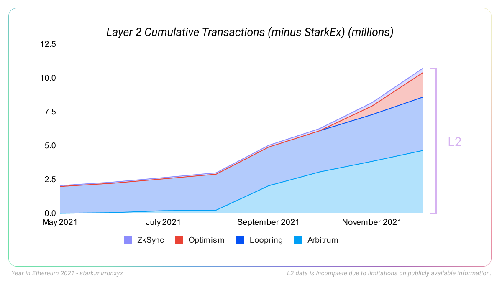

+++
title = "The Year in Ethereum 2021"
date = 2022-01-17T00:00:00
description = "The Year in Ethereum 2021"
tags = ["year-in-ethereum", "ethereum"]
draft = false

[params.cover]
image = "cover.png"
alt = "The Year in Ethereum 2021"
caption = "The Year in Ethereum 2021"
+++

*By [Josh Stark](https://twitter.com/0xstark) & [Evan Van Ness](https://twitter.com/evan_van_ness)*

**Ethereum is the foundation for a digital civilization.**

It is hardened, secure, and reliable. It is the bedrock necessary to support the digital cities being built on top of it.

Those cities are growing fast. Because Ethereum is open to everyone, many different users have found reasons to build on it:

* Markets use it as financial infrastructure
* Artists use it to give permanence to their work
* Assets use it as a settlement layer
* Communities use it to govern shared resources

This year Ethereum applications exploded into public consciousness. The [old term](https://blog.ethereum.org/2014/08/18/building-decentralized-web/) “web3” became fashionable again as the world began to understand the vision of a more decentralized internet built on Ethereum.

Just like in [2018](https://stark.mirror.xyz/w5DBtrkxEl2lI3P1RxmkVhqIhrp19g5zqU-RcZMR3ZQ), [2019](https://stark.mirror.xyz/32hW-yLR6riSmzQuuDDMX6XZhSh-k-RB7w5mvW0Vy9U), and [2020](https://stark.mirror.xyz/ywsx9-AsGR83LOyRUdDx2NpfaLEQdS0lKxHpHYwvzTI) our goal is to zoom out and show you the bigger picture.

In our view, the most important developments this year in Ethereum were:

1. **Layer 2 arrives** - *after years of development, L2 protocols launch on mainnet and expand Ethereum’s capacity*
2. **Creator economy goes mainstream** - *NFTs are everywhere and artists use Ethereum to earn billions*
3. **Core protocol upgrades** - *the Ethereum R&D community ships multiple upgrades, preparing for the transition to Proof of Stake*
4. **DAOs pass the tipping point** - *DAOs become a viable tool for communities to self-govern, accumulating billions of assets and drawing in new users*

Before covering the themes above, let’s stop to take stock of Ethereum’s growth. In past years, we’ve tracked different core metrics that try to place Ethereum in context. This year, some of those metrics crossed important milestones.

### A. What blockchains do people pay to use?

For the second year in a row, Ethereum is the world’s most in-demand blockchain.

Source: Cryptofees (cryptofees.info)

This graph shows the total [transaction fees](https://ethereum.org/en/developers/docs/gas/) for selected L1 blockchains. This is the sum of all fees paid to use each L1 - to send transactions, or interact with a smart contract. In total, they represent the value of that blockchain’s total “block space” - the total transaction capacity of that blockchain in a given year.

Total transaction fees are just one metric, and viewed alone they are an imperfect representation of the value of a blockchain or its utility to users. However, it does show us the comparative value of each blockchain to its users. In a functioning market, things are worth what people are willing to pay for them.

If we broaden our comparison to include applications, L2 networks, and other L1s, we see the following:

Source: Cryptofees (cryptofees.info)

Each of the pink entries is an application built on Ethereum, like [Uniswap](https://uniswap.org/) or [ENS](https://ens.domains/). For these applications, the fee totals here are *not* blockchain transaction fees, but other types of fees that the user pays to use the application (like fees paid to liquidity providers on an exchange).

Incredibly, in 2021 the value paid to use applications built on Ethereum exceeds the value paid to use all other L1 blockchains combined.

As the demand for Ethereum’s blockspace continues to outpace every other blockchain, we can look elsewhere for meaningful comparisons. This year, we can compare the fees paid to use Ethereum L1 to the revenues of payment networks like [Visa](https://annualreport.visa.com/financials/default.aspx) and [Stripe](https://backlinko.com/stripe-users#stripe-revenue-by-year):

Source: Cryptofees (cryptofees.info), Visa, Backlink

Total transaction fees and corporate revenue are not entirely comparable (Visa and Stripe earn revenue from sources other than fees paid by direct users, and Ethereum can do many things Stripe cannot). However, they give an indication of Ethereum’s scale and value to the market.

### B. How much value did Ethereum move?

One of the simplest use-cases of a blockchain is to transfer assets. How much value was transferred on Ethereum this year?

Since [surpassing Bitcoin in mid-2020](https://jjmstark.medium.com/the-year-in-ethereum-2020-98123e5f160d), Ethereum continues to be the blockchain that settles the greatest flow of assets around the world.

Ethereum data includes all major ERC20s w/volume greater than $500M. Bitcoin data includes USDT on Omni. Because we are not counting all assets on Ethereum, this chart understates Ethereum’s total volume. Data from Visa (annualreport.visa.com)and CoinMetrics (coinmetrics.io),

This year Ethereum moved approximately $11.6 trillion USD. That is [more than Visa](https://annualreport.visa.com/financials/default.aspx), and more than double Bitcoin.

### C. Value locked in DeFI

Finally, we can track the total value of all assets locked in DeFi protocols. Having assets “locked into DeFi” means that a user has deposited some funds into a protocol, usually to earn a return in exchange for letting the protocol use their assets - for example, as liquidity.

Ethereum’s DeFi sector continues to have the greatest amount of locked assets, by a large margin.

Source: DeFi Llama (https://defillama.com/chains)

Once again, we must look outside of the blockchain ecosystem to find comparable figures. In 2021, the total value locked in DeFi on Ethereum ($153 billion) exceeded the assets under management of Robinhood ([$80 billion](https://www.businessofapps.com/data/robinhood-statistics/)) and Bridgewater Associates ([$140 billion](https://en.wikipedia.org/wiki/Bridgewater_Associates)).

## 1. Layer 2 Arrives

After years of R&D, the technologies that will scale Ethereum went live this year.

The transaction capacity of Ethereum is no longer simply the capacity of Ethereum’s Layer 1.

**Instead, it is the capacity of Ethereum’s L1 *plus* the capacity of all “Layer 2” protocols that inherit Ethereum’s security.**

L2 data is incomplete due to limitations on publicly available information. All data here: https://docs.google.com/spreadsheets/d/1-Is51Do\_AgatnUsoxo-Iy7B0clCyxf1VN\_gDt8mtly4

This graph shows us the total cumulative transactions on Ethereum in 2021, including both L1 and L2.

In 2021, Ethereum’s L1 did about [1.2 million transactions per day](https://etherscan.io/chart/tx) (or about 15 transactions per second). As Layer 2 protocols came online, the effective capacity of Ethereum began to increase, and the combined transaction rate (the top line of the chart) started to curve upward.

All L2 protocols are still early in their deployment, and some have not yet removed all temporary trust assumptions (see [L2Beat for more info](https://l2beat.com/)). There are also notable differences between the technologies grouped here. Some of the StarkEx chains for instance are technically [Validiums](https://www.buildblockchain.tech/newsletter/issues/no-99-validium-and-the-layer-2-two-by-two), which means their proofs are stored off-chain, not on-chain.

As L2 protocols continue to mature and gain marketshare, the L2 portion of this graph will grow until it far exceeds the transaction capacity of L1. “Ethereum” no longer refers to a single protocol, but to a community of protocols that share a common L1.

You may have read that Ethereum is expensive or slow, but that’s only because people are making the wrong comparisons. Ethereum is the first blockchain to mature to the point of having multiple production-ready L2s built on it. Although gas fees remain high for some use-cases on L1, 2021 marks the inflection point towards a future where most users interact with Ethereum exclusively through L2.

The largest share of L2 transactions are currently being done on application-specific L2 protocols called “[ZK rollups](https://ethereum.org/en/developers/docs/scaling/layer-2-rollups/)”. These are L2s specialized for certain kinds of applications, like trading or simple token transfers.

The ZK rollup ecosystem built on Ethereum made progress in 2021:

* **Loopring** launched a zkRollup decentralized exchange [back in 2020](https://loopring.org/#/post/loopring-launches-zkrollup-exchange-loopring-io). They completed the launch of their [v2 in early 2021](https://loopring.org/#/post/shutdown-of-loopring-exchange-v1-transition-to-v2), and added support for NFT minting and trading in [August 2021](https://loopring.org/#/post/loopring-now-supports-nfts-on-l2).
* **Matter Labs** launched a payments rollup (zkSync) in [June 2020](https://blog.matter-labs.io/zksync-is-live-bringing-trustless-scalable-payments-to-ethereum-9c634b3e6823), which is integrated into wallets like [Argent](https://polynya.medium.com/argent-zksync-a-peer-to-peer-electronic-cash-system-dream-comes-to-life-8724a64e33f7) and applications like [Gitcoin](https://twitter.com/zksync/status/1405252225627086849) (and continue work on “[zkSync 2.0](https://blog.matter-labs.io/zksync-2-0-hello-ethereum-ca48588de179)” which will feature EVM compatibility)
* **Aztec** launched a private payments rollup (“zk.money”) in [March 2021](https://medium.com/aztec-protocol/launching-aztec-2-0-rollup-ac7db8012f4b), adding support for the DAI stablecoin in [April](https://medium.com/aztec-protocol/introducing-zkdai-into-the-aztec-private-rollup-203bd1b5164c).
* Multiple projects launched using **Starkware’s** [StarkEx platform](https://starkware.co/starkex/), including:
  + **DeversiFi** (a decentralized exchange) launched in [June 2020](https://deversifi.com/blog/deversifi-2-0-launch-was-a-huge-success/) (validium)
  + **ImmutableX** (an NFT exchange) launched in [April 2021](https://www.immutable.com/blog/immutable-x-alpha-trading-launch) (validium)
  + **dYdX** (a defi trading platform) launched in [April 2021](https://dydx.exchange/blog/public) (rollup)
  + **Sorare** (a fantasy football NFT project) launched in [July 2021](https://medium.com/sorare/were-live-on-our-scaling-solution-starkware-62438abee9a8) (validium)

L2 data is incomplete due to limitations on publicly available information. All data here: https://docs.google.com/spreadsheets/d/1-Is51Do\_AgatnUsoxo-Iy7B0clCyxf1VN\_gDt8mtly4

This year saw the launch of two new significant entrants to the rollup ecosystem: **[Arbitrum](https://offchainlabs.com/)** and **[Optimism](https://www.optimism.io/)**.

**Arbitrum** and **Optimism** are notable as the first *generalized* rollups to reach production. This means that each rollup operates like a natural extension of Ethereum - they are “[EVM](https://ethereum.org/en/developers/docs/evm/) compatible”. Users can easily migrate Ethereum-based assets to them, and developers can deploy Solidity contracts and applications to the rollups themselves where users can interact with them.

L2 data is incomplete due to limitations on publicly available information. All data here: https://docs.google.com/spreadsheets/d/1-Is51Do\_AgatnUsoxo-Iy7B0clCyxf1VN\_gDt8mtly4

Arbitrum [launched on mainnet](https://offchain.medium.com/introducing-arbitrum-one-our-mainet-beta-ed0e9b63b435?source=user_profile---------10-------------------------------) May 14th, and [removed their whitelist](https://offchain.medium.com/mainnet-for-everyone-27ce0f67c85e) on August 31st. Optimism followed a few months later, [launching on mainnet](https://medium.com/ethereum-optimism/community-launch-7c9a2a9d3e84) on August 19th and [removing their whitelist](https://optimismpbc.medium.com/all-gas-no-brakes-8b0f32afd466) on December 16th.

As the L2 ecosystem has grown, users are depositing more and more funds into them. As of this writing, [about $6 billion USD sits in L2 protocols](https://l2beat.com/).

### Rollups in context

The crypto community has been working to scale blockchains with “[Layer 2](https://medium.com/l4-media/making-sense-of-ethereums-layer-2-scaling-solutions-state-channels-plasma-and-truebit-22cb40dcc2f4)” technologies for a decade.

Payment channels on Bitcoin [were discussed as early as 2012](https://bitcointalk.org/index.php?topic=91732.0). While channels would eventually enter production on Ethereum as a relatively [niche scaling solution](https://thegraph.com/blog/scalar), they were not capable of scaling smart contracts.

In 2017, Vitalik and Joseph Poon proposed a new solution called [Plasma](https://plasma.io/). The basic idea was to scale Ethereum by creating separate blockchains which would be anchored to Ethereum, inheriting security through clever code and economic mechanisms.

This line of research led to a new technique called a “[rollup](https://github.com/barryWhiteHat/roll_up)”. Building on Plasma’s ideas, Rollups scale Ethereum by creating a distinct L2 blockchain that can be cheaper and faster to use, while still inheriting the security of L1.

Applications exist on the rollup chain, and users interact with the rollup chain directly. In the background, the protocol bundles (“rolls up”) everyone’s transactions and stores a record of them on Ethereum L1. These records ensure that these transactions benefit from Ethereum’s strong security.

But there are two different ways to do this, leading to two different types of rollup design: **Optimistic rollups** and **Zero-Knowledge rollups.**

In a Zero-Knowledge rollup, cryptography is used to *prove that the transaction was valid* and store that proof on Ethereum. Most of the data can be thrown away (meaning you don’t need to store it on-chain), and only a tiny piece of data remains. But it is enough to mathematically prove that the transaction was valid.

Today there are many *application specific* rollups live, which we covered above. But *generalized* ZK rollups are still a work in progress, being built by teams like [Matter Labs](https://blog.matter-labs.io/zksync-2-0-hello-ethereum-ca48588de179), [Starkware](https://starkware.co/starknet/) (alpha [launched in November](https://medium.com/starkware/starknet-alpha-now-on-mainnet-4cf35efd1669)), [Polygon Hermez](https://blog.hermez.io/introducing-hermez-zkevm/), [Scroll Tech](https://mobile.twitter.com/scroll_zkp), and the [Privacy & Scaling Explorations group.](https://hackmd.io/@yezhang/S1_KMMbGt)

To simplify a complex subject: ZK rollups work by converting code that runs on the rollup into a special mathematical equation. This equation is what gives us the concise proofs that are stored on mainnet.

It is a lot easier to define such an equation when the possible inputs are constrained. For instance, if we are only going to do simple token transfers. These *application specific* equations are easier to design.

It is much harder, in comparison, to define the equation that can take *any possible code input* and create a proof from it. That is the challenge of creating a ZK rollup that can be used for general arbitrary code.

This kind of “general” computation (also known as “EVM equivalence”) is much easier to achieve with Optimistic rollups.

With Optimistic Rollups, the L2 rollup chain leaves bundled-up records of transactions on L1.

However, the “proof” that would guarantee these results are valid is not actually *run* in most cases. The protocol is *optimistic* - it assumes that each block is valid, but we preserve the right to always *prove it* if necessary.

Because Optimistic Rollups need to preserve data so that someone can run the proof later, they require a larger amount of transaction data to be posted on-chain (instead of a tiny proof, already verified using zero-knowledge tech). But because no new cryptographic innovations are required, fully generalized Optimistic Rollups (like Arbitrum and Optimism) already exist today in production.

In either case, this means that you have a very high assurance that your transaction on a rollup is final. If someone sends you ETH on a rollup, the proof of that transfer lives on Ethereum, and you will always be able to withdraw that ETH to L1 if needed.

The long wait for Layer 2 is over. It’s here now - just very unevenly distributed. It will take months for applications, exchanges, wallets, to support L2 and help users make the transition.

# 2. Ethereum’s Creator Economy Goes Mainstream

In last [year’s blog post](https://jjmstark.medium.com/the-year-in-ethereum-2020-98123e5f160d), we noted that Ethereum’s “creator economy” was showing signs of growth.

[Cryptoart volume](https://cryptoart.io/) had risen steeply in December, and there were signs that more and more artists were experimenting with the tools that Ethereum gives them to capture the value of their work.

The year that followed exceeded expectations.

**In 2021, artists, musicians, writers, and other creators used Ethereum to [earn a combined $3.5 billion](https://docs.google.com/document/d/1zpHoC_EXKmMEdcmWnLLBCLqevepj2pUe0Gue1UndNbc).** This sum places Ethereum as one of the largest global platforms for creators.

Note: Ethereum data from 2021, all other data from 2020 due to limitations on publicly available information. All data documented here: https://docs.google.com/spreadsheets/d/1-Is51Do\_AgatnUsoxo-Iy7B0clCyxf1VN\_gDt8mtly4/

In 2021, Ethereum earned artists and musicians more money than OnlyFans or Patreon, and nearly as much as the largest creator platforms in the world.

### What is the creator economy?

Ethereum’s “creator economy” is the set of tools, services, and markets that enable creative people around the world to earn money from their work using Ethereum.

Until now, the internet’s “creator economy” has been dominated by large centralized platforms. Most of these use a similar model, where a platform like YouTube or Spotify earns revenue from ads or subscriptions, and then passes on a small fraction of that revenue to creators.

This business model turned Spotify into a $40 billion company. But it has always been unsatisfying to the majority of artists, who earn a tiny fraction of each stream. In 2020, only [13,400 artists](https://loudandclear.byspotify.com/?question=per-stream-rate#divContainerOverlay) made more than $50K from Spotify (from a pool of 1.2 million artists on the platform).

An even greater number of artists work for free by posting their work to Instagram or Twitter. The artist gets paid in “exposure”, while the platforms capture the value.

Ethereum gave creators new tools to monetize their work. One tool stands out in particular: the NFT. A digital certificate representing ownership of any digital file, ranging from art, music, photography, videos, or game items. During 2021, platforms like [OpenSea](https://opensea.io/), [Rarible](https://rarible.com/), [Foundation](https://foundation.app/), [Zora](https://zora.co/), and [Mirror](https://mirror.xyz/) enabled artists to create, sell, and trade NFTs.

The NFT ecosystem is in very early stages. Remember that a year ago, the market for NFTs barely existed. Today the vast majority of volume and users are [concentrated on one platform](https://dune.xyz/kvm/NFT-Marketplace-Comparison) (OpenSea). However, there are many projects working on launching competitors, including decentralized exchanges. As we learned from the history of decentralized exchanges (a “dex”) and Uniswap’s incredible growth, decentralized projects that give ownership to their users can [meaningfully compete with centralized incumbents](https://www.theblockcrypto.com/linked/79775/uniswap-coinbase-monthly-volume-september).

The rapid expansion of the NFT market drew mainstream interest. Steph Curry, Eminem, and Shaquille O’Neal bought Bored Apes. Adidas did too, and they also [bought digital land](https://venturebeat.com/2021/12/15/adidas-originals-launches-nft-drop-and-buys-a-plot-in-the-sandbox-metaverse/) and released their own NFT collection. Budweiser, Paris Hilton, Trey Songz, Drake Bell, and the CEO of Shopify all [registered ENS names and put them in their twitter handles](https://ethleaderboard.xyz/).

Looking beyond the soaring NFT valuations and celebrity interest, the emergence of Ethereum’s creator economy marks a quiet revolution for our community.

For most of the crypto industry’s history, the majority of the people who could make a living using these technologies belonged to only a few categories: investors, developers, or people who work for crypto companies.

But in 2021, that changed.

This year, a much greater number of people from new and very different professional backgrounds began using Ethereum to support themselves financially. In 2021, people can earn money using Ethereum without any pre-existing capital, without technical skills, without a background in finance or investing, and without a job at a crypto startup.

These creators are not just casual users, but core members of the Ethereum community who depend on it and have a meaningful stake in the ecosystem. This change has led to an influx of new people, ideas, communities, talent, viewpoints and concerns, changing Ethereum’s ecosystem and influencing its future.

Most notably, many new users of Ethereum are rightly concerned by the energy consumed by Proof of Work. Fortunately, they are joining a community who shares those concerns. [The Ethereum community has known since 2014](https://blog.ethereum.org/2014/01/15/slasher-a-punitive-proof-of-stake-algorithm/) that Proof of Work would grow to consume too much energy, and has been working ever since to end it.

# 3. Core Protocol Upgrades

In 2021, the Ethereum community made steady progress towards the transition to Proof of Stake, and shipped two major mainnet upgrades, bringing changes like a new fee market and many minor optimizations.

The research, development, coordination, and implementation of these upgrades is being performed by independent teams all over the world, through open research and collaboration. As always, Ethereum is a [bazaar, not a cathedral](http://www.catb.org/~esr/writings/cathedral-bazaar/).

A significant amount of this work is done by the teams that build and maintain individual clients. Ethereum is notable as the only blockchain that has multiple independent teams actively building production client software.

**Client diversity has always been a priority for the Ethereum community, even as it remains challenging in practice.** Client diversity helps protect against [bugs in a specific client which might destroy its monetary value](https://bitcoincore.org/en/2018/09/20/notice/), but also as a check against governance being captured by a clique of core developers. Ethereum is a “specification first” blockchain, meaning that the rules of the protocol are independent from any particular piece of software or set of individuals maintaining that software. Anyone can implement the specification, and build their own client to compete with the existing ones.

This year, client teams and the larger R&D community shipped two substantive upgrades to Ethereum mainnet: “[Berlin](https://ethereum.org/en/history/#berlin)” in April, and “[London](https://ethereum.org/en/history/#london)” in August. These upgrades included multiple changes. Most notable was [EIP-1559](https://github.com/ethereum/EIPs/blob/master/EIPS/eip-1559.md), which reformed the Ethereum fee market (discussed in depth below), but also included critical changes like EIP-2929 which improved Ethereum’s defense against DOS attacks.

Teams also shipped the “[Altair](https://ethereum.org/en/history/#altair)” upgrade to the “Beacon chain” - the Proof of Stake chain that has been running in parallel alongside Ethereum mainnet since Dec 1, 2020. The Altair upgrade both enabled light clients for consensus as well as updating slashing and liveness incentives.

In the background of all this work is the constant progress towards “[the Merge](https://ethereum.org/en/eth2/merge/)” - the moment when Ethereum’s Proof of Work system will be turned off forever, in favour of Proof of Stake (discussed in depth below).

Even during this period of change, Ethereum mainnet continues uninterrupted, processing and securing billions of dollars.

### EIP-1559 - Fee Market Reform

On August 5, EIP-1559 went live on Ethereum mainnet. This upgrade introduced several reforms to Ethereum’s “fee market”, the set of rules that define the marketplace in which users pay to have their transactions recorded in the Ethereum blockchain.

EIP-1559 had multiple goals:

* Make it less likely that a user would overpay for their transaction
* Reduce the rate of stuck transactions
* Enhance protocol security by making re-orgs less likely, and making DOS attacks more expensive
* Burn a portion of fees, which can accrue value to ETH and raise Ethereum’s economic security

**As with most Ethereum protocol upgrades, this was the result of many years of research, development, testing, and debate by the Ethereum community.** A [2014 blog post by Vitalik](https://blog.ethereum.org/2014/02/01/on-transaction-fees-and-the-fallacy-of-market-based-solutions/) shared early ideas, followed by [an ethresear.ch post in July 2018](https://ethresear.ch/t/first-and-second-price-auctions-and-improved-transaction-fee-markets/2410), and the [draft EIP](https://eips.ethereum.org/EIPS/eip-1559) (“Ethereum Improvement Proposal”) in 2019. This was followed by two years of analysis and discussion, including [a study by Tim Roughgarden](https://timroughgarden.org/papers/eip1559.pdf).

EIP-1559’s adoption is not yet complete. Some wallets, exchanges, and other applications need to upgrade their own software to fully take advantage of the new fee market.

Source: Pintail (https://pintail.xyz/posts/gas-market-analysis/)

This graph shows the breakdown of transactions on Ethereum “Type 2” (tx that utilize EIP-1559) and “Legacy” transactions. By the end of 2021, about 35% of transactions on Ethereum were still using “legacy” transactions. However, even legacy transactions benefit from EIP-1559, because it improves the way gas estimates are produced.

Many wallets and exchanges already enabled EIP-1559 transactions, including [MetaMask](https://metamask.io/1559), [Rainbow](https://twitter.com/rainbowdotme/status/1471242878177398794), [MyCrypto](https://twitter.com/MyCrypto/status/1423302929637724165), [Frame](https://twitter.com/0xFrame/status/1423367580291674112), [Trezor](https://twitter.com/Trezor/status/1438503063157809154), [Brave](https://twitter.com/lukemulks/status/1436381468272390151), [Coinbase](https://blog.coinbase.com/the-technical-benefits-of-eip-1559-c41bb85f5924) (and [Coinbase wallet](https://twitter.com/CoinbaseWallet/status/1468969381015154692)), [Blockfi](https://etherscan.io/address/0x808b4da0be6c9512e948521452227efc619bea52), [FTX](https://etherscan.io/address/0x2faf487a4414fe77e2327f0bf4ae2a264a776ad2), and several others.

Four months after the change took effect, EIP-1559 is accomplishing its goals in improving the user experience on Ethereum:

Source: Pintail (https://pintail.xyz/posts/gas-market-analysis/)

In this graph, the blue line shows the median gas price for legacy transactions, and the orange line shows the gas price for type 2 (EIP-1559) transactions. After EIP-1559 was implemented, type 2 transactions have been on average lower than legacy transactions.

Source: Pintail (https://pintail.xyz)

This graph shows the benefits in more detail. The blue line shows the difference in gas prices between the two types of transactions since EIP-1559 went live (the higher the line, the greater the savings). Legacy transactions are consistently 10-20 gwei more expensive.

EIP-1559 also seems to have reduced the likelihood of stuck transactions, without requiring users to pre-emptively over pay for inclusion (which many users, accustomed to stuck transactions, had been doing). If you’re interested in learning more, see [this post by pintail](https://pintail.xyz/posts/gas-market-analysis/), [this post from Coinbase](https://blog.coinbase.com/the-technical-benefits-of-eip-1559-c41bb85f5924), and [this post by blocknative](https://www.blocknative.com/blog/eip-1559-adoption).

### FEEL THE BURN

EIP-1559 also introduced a change whereby a portion of the fee that every user pays to use the protocol is destroyed (“burned”). This means that with every transaction, an amount of ETH is being removed from the total supply.

This creates a mechanism which accrues value to ETH - an important piece of the broader vision to make Ethereum [the world’s most secure blockchain](https://www.youtube.com/watch?v=bWqhn1hXvVc).

Ethereum’s consensus mechanism depends, in part, on the value of ETH. Under PoW that is because miners are paid in ETH for their work to secure the network, and under PoS it is true because stakers are both paid in ETH to secure the network, and because they are required to stake ETH to provide that security.

Burning a portion of the fees creates a relationship between the use of the protocol (tx fees) and the value of ETH itself (by reducing supply). Since August, [1.32 million ETH were burned in 2021.](https://dune.xyz/queries/167332/325105)

Source: Watch the Burn (https://watchtheburn.com/insights)

The yellow bars represent days and weeks of negative issuance, where Ethereum was used heavily enough - and enough fees were paid - that the burn from EIP-1559 exceeded the new issuance that occurs with every block. Keep in mind that these are the results under the current PoW system, and the shift to PoS will enable even lower issuance.

### THE MERGE

The migration from Proof of Work to Proof of Stake has been the vision of the Ethereum community since its [earliest days](https://blog.ethereum.org/2014/01/15/slasher-a-punitive-proof-of-stake-algorithm/).

While Proof of Work may have been necessary to launch the first experiments in blockchain design, it has become clear in the intervening 12 years that better designs are possible. Designs that are far more secure, and do not consume extraordinary amounts of energy in order to produce strong economic security guarantees.

Ethereum’s Proof of Stake system is the culmination of 7+ years of research and development. Why has this taken so long? Since the beginning of this process, the Ethereum community has been unwilling to compromise on decentralization.

While there are different Proof of Stake systems on other chains today, most of them make significant concessions on decentralization. They rely on some form of *delegation*, meaning that the actual role of block validation is centralized in the hands of a small number of stakers.

**While some communities settled, Ethereum innovated**. New technology and techniques were advanced to keep Ethereum maximally decentralized and secure. [Advancements in BLS signatures](https://twitter.com/technocrypto/status/1330150362427387910) used in Ethereum’s PoS enable many thousands of nodes to participate in consensus, meaning that there is no delegation required in Ethereum’s PoS. Thousands of individual validators participate, instead of a handful of professional staking orgs.

At the same time, Ethereum’s design keeps the technical requirements for staking low. Low enough that anyone with a consumer laptop can stake from home, and be on a similar footing to professional staking services.

Ethereum’s Proof of Stake system is [already live](https://beaconcha.in/) - it’s just not being used to secure any user activity yet. The [Beacon Chain](https://ethereum.org/en/eth2/beacon-chain/) - Ethereum’s Proof of Stake mechanism - has been live since December 1 2020, running without any major issues.

Over the last year, users have staked more than 8 million ETH into the Beacon chain, worth approximately $26 billion USD:

Source: @Carvas (https://dune.xyz/queries/252741/473336)

The remaining work to be done is to *merge* the existing Ethereum L1 into its new Proof of Stake infrastructure, replacing Proof of Work.

Source: Trent Van Epps (https://twitter.com/trent\_vanepps)

With the beacon chain humming along, the Ethereum community passed multiple milestones towards the merge:

* In April, the [Rayonism project](https://rayonism.io/) saw developers hack together testnets that simulated the merge, as well as some early sharding designs.
* In October, client teams gathered in Greece for the [Amphora retreat](https://blog.ethereum.org/2021/10/15/amphora-merge-milestone/) that produced a short-lived multi-client testnet.
* In November, the [Kintsugi testnet](https://blog.ethereum.org/2021/12/20/kintsugi-merge-testnet/) continued that work with a long-lived multi-client testnet based on [the latest specification](https://github.com/ethereum/consensus-specs/releases/tag/v1.1.4).

Once specifications are finalized and new testnets have been used extensively by end users and application developers, existing testnets will be used to conduct trial runs of the Merge.

Assuming these trial runs go smoothly, the focus will then shift to the final step: carrying out the Merge on mainnet and ending Proof of Work forever.

### Client diversity

Ethereum has many client implementations, each of which has a different share of the total validators who participate in Proof of Stake.

Today, client diversity is far from optimal:

Source: https://twitter.com/sproulM\_/status/1481109509544513539

**In an ideal world, no client should have more than 33% of the network.** If each individual client is below this percentage, it reduces the risk that a bug found in a client would impact the network.

Ideal client diversity is a theoretically achievable goal: Ethereum has 4 excellent staking clients ([Lighthouse](https://lighthouse.sigmaprime.io/), [Nimbus](https://nimbus.team/), [Prysm](https://prysmaticlabs.com/), [Teku](https://docs.teku.consensys.net/en/latest/)), with a fifth candidate ([Lodestar](https://github.com/ChainSafe/lodestar)) emerging recently.

Before the merge, it would be beneficial if no client had more than 50% of the network. Without going into too much detail, in the case of an (unlikely) chain fork, clients staying below 50% would provide a buffer of safety for client devs to fix the issue without a mass slashing event.

It’s in everyone’s interest to move towards better client diversity - even the developers of a majority client. To their credit, Prysmatic Labs [recognizes this fact and is working to reduce their majority](https://medium.com/prysmatic-labs/prysmatic-labs-statement-on-client-diversity-c0e3c2f05671).

### The staking ecosystem expands

Ethereum’s Proof of Stake allows everyone, from hobbysts to institutions, to stake ETH and participate in securing the network. As the community of stakers has grown, an ecosystem of services, tools, infrastructure, and applications has developed:

* **[Rocketpool](https://rocketpool.net/)**, the greatly anticipated decentralized staking protocol, launched in November 2021. Rocketpool is a protocol that lets users deposit ETH and share in staking rewards, without having to manage any staking infrastructure on their own. In short, users of the protocol securely deposit their ETH to a network of individual node operators, coordinated by the Rocketpool protocol. Decentralized staking protocols are an essential piece of infrastructure for fostering a healthy staking ecosystem. As of this writing, [74K ETH](https://rocketpool.net/) have been staked into Rocketpool.
* **[Lido](https://lido.fi/ethereum)** is also a staking protocol, but one with [additional trust assumptions](https://blog.lido.fi/the-road-to-trustless-ethereum-staking/) in its current implementation. By [January 2021](https://twitter.com/LidoFinance/status/1475925295073046538) (2 months after the beacon chain launch), 100K ETH were staked with Lido. By the end of this year, 1.6 million ETH worth [$13 billion](https://twitter.com/LidoFinance/status/1475925300986925059) were staked in Lido, by [33K unique depositors.](https://dune.xyz/queries/95826/191739) Recently, Lido has made [good progress towards client diversity](https://research.lido.fi/t/lido-node-operator-validator-metrics/1431?u=timbeiko) among their network of operators who serve the protocol.
* Along with this, there was growth in the ecosystem of staking tools
  + The **StakeHouse** community released [eth-wizard](https://github.com/stake-house/eth-wizard) (a CLI staking installation tool for hobbysts) and [Wagyu](https://github.com/stake-house/wagyu) (a one-click Eth2 staking installer)
  + Existing node hardware providers **[Dappnode](https://dappnode.io/)** and **[Avado](https://ava.do/)** expanded their offerings for Ethereum staking
  + **[Stereum](https://stereum.net/)** launched an open-source [node setup tool](https://stereum.net/ethereum-node-setup/)

Want to stake your ETH? The best place to start is [ethereum.org](https://ethereum.org/en/eth2/staking/#main-content).

# 4. DAOs Pass The Tipping Point

One of the earliest dreams for Ethereum was to enable “Decentralized Autonomous Organizations” (DAOs). Because Ethereum enables anyone to write arbitrary rules in code, we can use those rules to design organizational or governance systems that allow groups of people to jointly make decisions through voting or other mechanisms.

The DAO ecosystem had a breakout moment his year. A simple but workable tech stack came together to enable existing DAOs to get things done, and new entrants pushed the boundaries of what a DAO can be and who can be a part of one.

The number of unique monthly voters who participate in DAOs on [Snapshot](https://snapshot.org/#/) grew throughout the year, and exploded in November and December:

Source: Snapshot

Today, there are hundreds of DAOs that see daily activity, pay members, build products, and vote on the use of shared funds. Collectively DAOs on Ethereum [govern assets worth more than $16 billion](https://openorgs.info/).

### But first: what is a DAO, again?

“DAO” is used to describe a large range of structures. Generally, a DAO refers to any group of people who use a blockchain like Ethereum to collectively govern some on-chain *thing*. Sometimes that thing is money (like ETH or tokens in a DAO treasury fund), but could also include NFTs, the parameters of an on-chain protocol like MakerDAO, or all of the above.

While DAOs have existed on Ethereum since 2016, these early experiments were more science project than real product.

**But in the last few years, DAOs became a practical necessity.** The first major driver were DeFi protocols who wanted to credibly decentralize themselves - handing control over their protocol to the crowd of users, who vote using tokens (“governance tokens”).

The basic structure pioneered by [protocols like Compound in 2020](https://medium.com/compound-finance/compound-governance-decentralized-b18659f811e0) have become the de-facto standard for many DAOs launched since, like [Uniswap in September 2020](https://uniswap.org/blog/uni).

In 2021, DAO growth was notable because it was happening *outside* of the DeFi protocols who were the first major entrants. These DAOs began to show the breadth of the design space possible for on-chain organizations.

* **Ethereum Naming Service (ENS)**. First [launched in 2017](https://mobile.twitter.com/ensdomains/status/1389573520439525380), ENS is a [decentralized naming protocol](https://ens.domains/) that lets users create simple usernames (yourname.eth) which can be used as Ethereum accounts, to receive non-ETH crypto (including Bitcoin), or as a web URL. In 2021, ENS launched a [DAO](https://docs.ens.domains/v/governance/) which governs certain parameters of the ENS protocol, and a community fund to support the ENS ecosystem.
* **ConstitutionDAO.** In the span of a few short days in November, strangers from across the internet pooled a collective $44 million dollars in order to buy a copy of the US constitution. In total, [17,521 distinct accounts](https://dune.xyz/ilemi/ConstitutionDAO-Funding-Tracker) donated to the effort. The project gained [mainstream coverage](https://www.cnn.com/2021/11/18/investing/constitution-auction-sothebys-crypto/index.html), and resulted in a [wild livestream](https://youtu.be/1TBa-9Lx3vc?t=9172) of bemused auctioneers mediating a bidding competition between a representative of the new internet of organizations, and the [old world of finance](https://www.theverge.com/2021/11/19/22791989/citadel-ceo-ken-griffin-won-constitutiondao-sothebys-auction).
* **PleasrDAO** [began with a tweet](https://twitter.com/lay2000lbs/status/1375195529504829443), and soon grew into an investment club. PleasrDAO is exploring a different part of the DAO design space - rather than a mass organization with tens of thousands of members, it’s a [relatively small investment club](https://pleasr.org/#) where members pool capital to make joint purchases. Notably, PleasrDAO has purchased several high profile cultural assets, like the [Doge 1/1](https://gallery.so/pleasrdao/88e17512d861358bac33a3310b6d65cf/6771f6edb51b930821f424452e1707b4), or the unreleased WuTang album.
* **Friends with Benefits (FWB)** is an [online social community](https://www.fwb.help/) where membership takes the form of ownership of the $FWB token. The token is used to control access to various online and offline spaces: chat groups, meetups, dinners, after parties, etc.
* **MakerDAO** began as a DAO, but then established some traditional org structures in 2018. MakerDAO is the creator of the DAI stablecoin, the first decentralized stablecoin on Ethereum and one of the most successful DeFi projects to date. This year, MakerDAO [completed the promised return to decentralization](https://blog.makerdao.com/makerdao-has-come-full-circle/) by winding down its foundation and handing control of the Maker protocol over to a DAO governed by its token holders.

DAOs are an incredibly general toolkit, enabling a large design space. With private keys and smart contracts, we can design nearly any arbitrary system through which humans can jointly govern on-chain assets and protocols.

As a result, we see this huge range of utility for DAOs. Soon it may become difficult to talk about them as a useful category. DAOs are a means for protocols to meaningfully decentralize themselves away from founder control, tools for online communities to quickly and seamlessly pool capital to achieve shared goals, a new type of social network, and a new way to collectively fund public goods.

The growth in DAOs this year was enabled by a set of software tools that makes it easy to get started.

Many DAOs use a simple combination of tools. For the on-chain smart contracts, most use a fork of [Compound’s system](https://compound.finance/docs/governance). Voting itself is handled by projects like [Snapshot](https://docs.snapshot.org/), and discussion and debate of individual proposals happens on forums like a [discourse](https://www.discourse.org/).

In 2021, the range of tools available to create and manage DAOs expanded:

* **[Mirror](https://mirror.xyz/)** [launched a suite of tools](https://dev.mirror.xyz/WPnZICvS2XbHJQ3u-GrsvYqios3XWmZhQvTKEyUJOGE) that help people create “Media DAOs”: joint publishing and ownership of content created on Mirror.
* **[Coordinape](https://coordinape.com/)** spun out of the Yearn community, and offers a framework for distributed teams to collaboratively decide on compensation for work done by DAO members.
* **[Rabbithole](https://rabbithole.gg/)** launched tools to onboard new users to DAOs and build the skills and credentials to work for DAOs.
* Forward-thinking governments have developed novel legal structures to streamline DAO formation and reporting, like in [Wyoming](https://www.jdsupra.com/legalnews/crypto-daos-and-the-wyoming-frontier-9251606/).

There’s no shortage of problems and challenges for DAOs to overcome as they scale to suit the needs of the millions of people around the world who want to use them. A few key challenges that we hope to see progress on in 2022:

* Today most DAOs use some form of coin voting. This means that decisions are made in proportion to ownership of some “governance token”. There are many [known downsides of coin-voting systems](https://vitalik.ca/general/2021/08/16/voting3.html). Experiments in sybil-resistance like [Proof of Humanity](https://www.proofofhumanity.id/) and [BrightID](https://www.brightid.org/) offer one way to build governance systems on the basis of individual people, and not tokens.
* Finding management structures and work systems that enable distributed groups to meaningfully build products and coordinate actions.
* Legal systems can be very slow to adapt to new forms of productive human activity, and DAOs are no exception. The lack of clear legal frameworks can introduce risk for DAO members. Work continues on this in jurisdictions around the world - for recent work in the US context, see this paper [by David Kerr and Miles Jennings](https://a16z.com/wp-content/uploads/2021/10/DAO-Legal-Framework-Jennings-Kerr10.19.21-Final.pdf).

New organizations are emerging to address these, and other challenges. [The DAO Research Collective](https://www.daocollective.xyz/) is one such organization, with the goal of making it easier for DAO founders to find answers and information about these questions.

# 5. Onwards!

As with every year, there’s too much happening in the Ethereum ecosystem to sum up in one blog post. But Ethereum is much bigger than the 4 themes above - a few other developments from 2021:

* **Identity:** The Ethereum Name Service (ENS) saw breakout growth, growing to [hundreds of thousands of users](https://ens.domains/#home-statistics), hundreds of integrations, and a new DAO community treasury ($1.9B) to fund continued development of the ecosystem. [Proof of humanity](https://www.proofofhumanity.id/) and [BrightID](https://www.brightid.org/) gained use as an anti-sybil mechanism, the [Sign in with Ethereum](https://login.xyz/) standard gained traction, and it [became fashionable](https://ethleaderboard.xyz/) to have an Ethereum identity.
* **Gaming:** [Axie Infinity](https://axieinfinity.com/) saw [incredible growth to 2.9 million users](https://blockworks.co/axie-infinity-program-lead-2022-will-be-all-about-gameplay/), becoming the most successful game built on Ethereum. New kinds of crypto organizations like [Yield Guild](https://yieldguild.io/) spurred interest in the play-to-earn gaming ecosystem. [Skyweaver](https://www.skyweaver.net/) [launched on Polygon](https://www.skyweaver.net/news/soft-launch-announcement), and [Dark Forest](https://blog.zkga.me/) shipped v0.6 and continued to build a cult following around its crypto-native on-chain strategy game.
* **Public goods funding:** [CLRFund](https://clr.fund/) (a protocol that lets anyone run their own CLR) [completed their trusted setup ceremony](https://blog.clr.fund/trusted-setup-completed/) and facilitated multiple rounds. [Gitcoin](https://gitcoin.co/grants/) continued their successful CLR product, funding more than [$24 million across the year](https://gitcoin.co/results). Optimism ran an experiment in [retroactive funding for public goods](https://twitter.com/optimismPBC/status/1445444759628091392), and the Ethereum Foundation [launched a client incentive program](https://blog.ethereum.org/2021/12/13/client-incentive-program/) to sustainably fund client development and maintenance. A new public goods organization - [0xPARC](https://0xparc.org/blog/why-0xPARC) - launched to focus on application-level innovation.

2021 was a bullish year for the Ethereum community. The ecosystem passed major milestones and the end of Proof of Work is in sight.

It’s easy to feel like a winner when the market is in your favour. It’s even easier to get distracted.

But this city won’t build itself - see you on the other side of Proof of Work.

-- *Josh Stark & Evan Van Ness*

---

**🙏 Special thanks to [Bruno Lulinski](https://twitter.com/BLulinski), [Miguel Pereira](https://twitter.com/_miguelemos), and [Nazim Rizvic](https://twitter.com/NazimRizvic),** who assisted with research, drafting, and data analysis for this year’s post!

*Thank you also to Superphiz, Lakshman Sankar, Liam Horne, Danny Ryan, Tim Beiko, Dankrad Feist, Trent Van Epps, Barry Whitehat, and Fabien from Snapsho*t.

*All data cited in this blog post can found [here.](https://docs.google.com/spreadsheets/d/1-Is51Do_AgatnUsoxo-Iy7B0clCyxf1VN_gDt8mtly4/edit?usp=sharing)*

</div