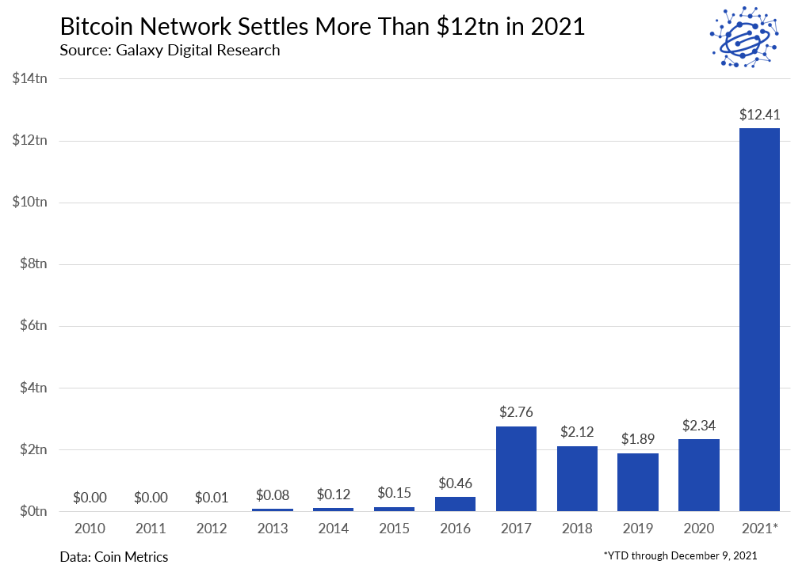

+++
title = "What was Bitcoin's total transaction volume in 2021?"
date = 2022-04-26T12:00:00
description = "test"
tags = ["hardness", "ethereum"]
draft = false
+++

By Josh Stark & Bruno Lulinski

In the Year in Ethereum 2021, we published a chart comparing the total transaction volume of the Ethereum and Bitcoin blockchains. Last year, Ethereum transferred approximately $11.6 trillion (ETH and ERC-20s), and Bitcoin transferred approximately $4.6 trillion (BTC and USDT).

After publishing, we saw a graph from Galaxy Digital claiming that in 2021 Bitcoin had settled $12.41 trillion USD:

Ark Invest also posted a chart with similar figures, showing Bitcoin settled $13.1 trillion:

What’s going on here? Figuring this out was a fun mystery to work through, and along the way we learned a lot about the nuances of how different sources define and report on-chain metrics.

TL;DR

Different blockchain data providers sometimes use very similar terminology to describe completely different metrics
Our lower figure from Coin Metrics excludes all UTXO change-related transactions and some internal transactions (e.g. within exchanges), which we believe is the best figure to use to compare to Ethereum
The larger figures from Galaxy and Ark exclude only obvious or “naive” UTXO change transactions, and thus still include a significant amount of change & internal transactions
The first thing we did of course was to review and triple-check our work to ensure that we had not made an error or misrepresented any data.

Our graph was created using the following methodology, which is the same approach used for a similar graph in 2020:

For Ethereum, we are including transaction volume from ETH and all ERC-20 assets which had a volume of greater than $500M.
This means we are under-counting Ethereum’s effective volume, since we’re missing the long-tail of ERC-20 activity, as well as other non ERC-20 assets like NFTs.
For Bitcoin, we are including volume from BTC and also USDT on Omni.
For all assets, we are using the “Adjusted Transfer Value” metric from Coin Metrics. Coin Metrics defines this as “The USD value of the sum of native units transferred that interval removing noise and certain artifacts”.
The reason we chose this metric is because we want to show and compare “real” economic value transfer on each network, removing as much non-meaningful activity as possible. This is especially important since elsewhere in the post we compare these figures to Visa’s total settlement for the year.
The calculation and data sources for this are documented in a google sheet here, which was linked in the original YiE 2021 post.

After reviewing, we were very sure we had not made any errors.

So, we had a mystery. Why are Coin Metrics and Galaxy/ARK’s data diverging so significantly on what should be comparable figures?

We reached out to Galaxy Digital, Coin Metrics, and ARK Invest to see if they could help shed light on what was going on here. We benefited from the help of Kyle Waters from Coin Metrics, Jacob Panek at AllianceDAO (formerly of Coin Metrics), Nishita Jain from ARK Invest, and Rafael Schultze-Kraft from Glassnode. Unfortunately Galaxy Digital never got back to us.

The first thing we wanted to understand was the Coin Metrics data we were relying on.

Coin Metrics has two relevant metrics here:

“Transferred Value” (~$13T in 2021 for Bitcoin)
“Adjusted Transfer Value” (~$4T) which we used in our chart
Both of these metrics remove “obvious change”. If you’re only familiar with how Ethereum and other EVM chains work, you might be unfamiliar with change outputs and the Bitcoin UTXO model.

Ethereum uses an “account” model, which is easy to understand intuitively: addresses are like accounts, and they own sums of assets like ETH and ERC-20s. In Bitcoin, addresses own discrete “Unspent Transaction Outputs” (UTXOs). So if you have 5 BTC, what you actually have might be a UTXO with 2 BTC, and a UTXO with 3 BTC, both controlled by your wallet.

Anytime you transfer Bitcoin, you are “using up” one of those UTXOs. So imagine you want to send only 0.5 BTC to someone. Your wallet will “spend” the whole 2 BTC UTXO, sending 0.5 to your recipient (creating a new UTXO of 0.5 BTC), and sending 1.5 BTC back to you in a new UTXO containing 1.5 BTC. Here’s a more in-depth explanation.

So, when measuring total transaction volume on Bitcoin, data sites typically filter out “change outputs” like the 1.5 BTC transfer in the example above, because no money is actually changing hands. It’s just something required by the UTXO model. Only the 0.5 represents “real” economic activity.

Some change transactions are very easy to identify. For instance, when a change output gets sent back to the same address that sent the transaction, this is “obvious change”. However sometimes people use different addresses to receive their change (this is generally a good security practice), meaning not all change will be captured by this heuristic.

So both figures provided by Coin Metrics remove obvious change. The Adjusted Transfer Value (ATV) metric that we used for our graph goes further, by using two additional heuristics to remove non-meaningful transactions:

ATV removes transactions that are assumed to be change due to their use of round numbers. For example, if a UTXO is split into 2.0000 BTC and 0.195482 BTC, we might assume that the latter is change.
ATV also removes “early spend” transactions. These are transactions that are sent, and then re-sent shortly afterwards, maybe multiple times. This is a common heuristic that is used to identify transactions that are internal (e.g. moving money around within an exchange), or related to the operation of an application like a mixer.
ATV also makes several adjustments which apply to ETH and ERC-20s, like removing pass-through accounts, which arise from events like exchange deposits or flash loans.
Around the same time, we heard back from Nishita at ARK Invest. She shared that the $13T figure from the graph came from Glassnode, specifically their “change-adjusted volume” metric. This metric is defined by Glassnode as “The total amount of coins transferred on-chain, adjusted by change volume. Only successful transfers are counted”.

We then reached out to Glassnode to learn more about this metric. Rafael told us that Glassnode uses three different metrics for volume:

Naive volume: ~$48 trillion for BTC in 2021
Change-adjusted volume: ~$13 trillion for BTC in 2021
Entity-adjusted: ~$3.3 trillion for BTC in 2021
At this point, the picture is starting to come together clearly:

Coin Metrics and Glassnode each report a volume figure that adjusts for obvious change transactions, showing approximately $13 trillion 2021. However they label them differently: Coin Metrics calls this “Transfer Volume” and Glassnode labels this “Change-adjusted Volume”.
Coin Metrics and Glassnode each report a volume figure that makes further adjustments, though they diverge on what adjustments they are making leading to different figures. Coin Metrics calls this “Adjusted Transfer Volume” and it removes even-amount change and early-spend transactions, which results in a figure of $4T. Glassnode uses proprietary methods to remove various transactions within clusters of accounts which are believed to be controlled by single entities, which results in a figure of $3.3T.
These different metrics explain the discrepancy between our graph and ARK/Galaxy Digital’s graph. Our graph is showing the second figure, which adjusts all change and a lot of “internal” transactions ($4.6T). ARK/Galaxy are showing a mostly-unadjusted figure, which would still capture significant amounts of change and internal transactions ($13T).
Both are true, they are just measuring different things.
Phew! Mystery solved.

In conclusion, here’s what we take away from this:

The terms used across different blockchain data providers are not always consistent. In this case, “adjusted” and “unadjusted” were used to mean different things between Coin Metrics and Glassnode. If you’re using data from multiple sources, be very careful to learn the details of what your metrics are measuring.
For the purposes of our chart comparing Ethereum and Bitcoin volume, we should continue to use metrics that remove as much change as possible from the Bitcoin data. Because Ethereum does not use a UTXO model, only by removing all change outputs are we making a fair comparison. Frankly, data that includes change outputs is not a very useful indicator of any kind of real economic activity or user adoption.
That means we should use either Coin Metric’s adjusted transfer volume, or Glassnode’s entity adjusted volume. Unfortunately neither provider offers a metric that only removes as much change as possible, but does not make other adjustments (e.g. for intra-entity transactions). One challenge with this according to Coin Metrics is that there is a lot of overlap between these approaches - for instance, users withdrawing from an exchange, and the exchange receiving change back to their own address.
Are volume metrics which do not exclude internal transactions useful? This really depends on your goal. Internal transactions obviously do not represent “real” economic activity, since they are just one person or one entity moving money between wallets they control. Sharing these figures without explaining that they include internal transactions can be very misleading, because readers might assume that these figures represent the “common sense” meaning of a transaction, which is between different persons or entities.
However, these transfers are still taking place on-chain, with fees being paid for them - they indicate something about the capacity of a network to settle value, and are useful for understanding fee market dynamics.
Further reading:

Following our conversations, Coin Metrics published a report digging into some of the details of how they do this: https://coinmetrics.io/on-chain-volume/
NYDIG also published a useful article  about the complexities of calculating transaction volume on Bitcoin’s blockchain and pointing out the differences between Glassnode and Coin Metrics transaction volume, as described above:

https://viewemail.nydig.com/the-complexities-of-measuring-transaction-volumes